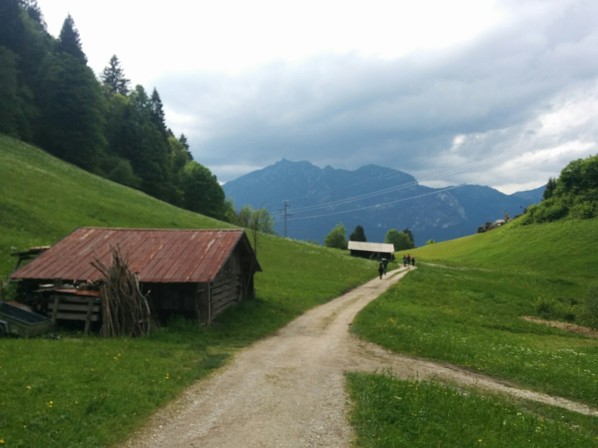
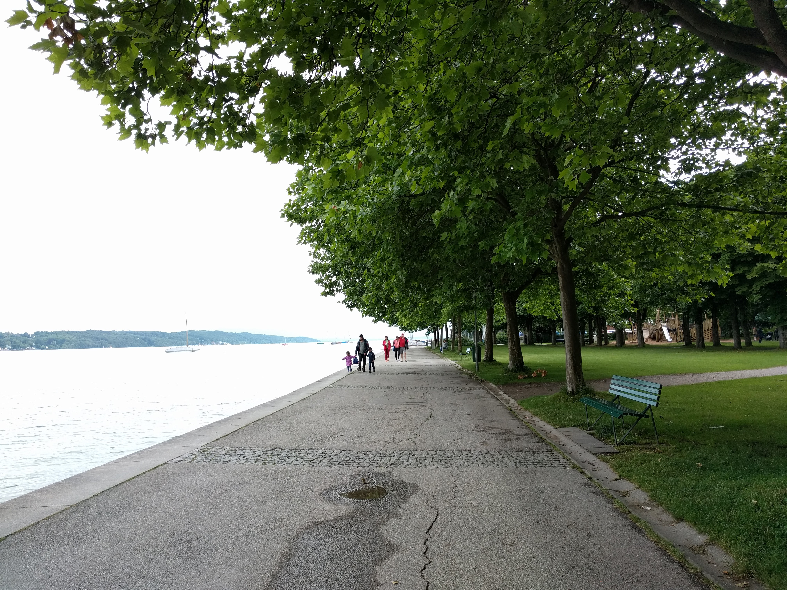

<!-- Main -->

<!-- One -->
<section id="one">
	

		<header class="major">
			<h2>Germany</h2>
		</header>
		
.

	

</section>

<!-- Two -->
<section id="two" class="spotlights">
	<section>
		
		

			

				<header class="major">
					<h3>Ammersee</h3>
				</header>
				
.

				<ul class="actions">
					<li><a href="germany.html" class="button">Learn more</a></li>
				</ul>
			

		

	</section>
	<section>
		
		

			

				<header class="major">
					<h3>Berlin</h3>
				</header>
				
.

				<ul class="actions">
					<li><a href="germany.html" class="button">Learn more</a></li>
				</ul>
			

		

	</section>
	<section>
		
		

			

				<header class="major">
					<h3>Chiemsee</h3>
				</header>
				
.

				<ul class="actions">
					<li><a href="germany.html" class="button">Learn more</a></li>
				</ul>
			

		

	</section>
	<section>
		
		

			

				<header class="major">
					<h3>Eibsee</h3>
				</header>
				
.

				<ul class="actions">
					<li><a href="germany.html" class="button">Learn more</a></li>
				</ul>
			

		

	</section>
	<section>
		
		

			

				<header class="major">
					<h3>Garmisch Partenkirchen</h3>
				</header>
				
.

				<ul class="actions">
					<li><a href="germany.html" class="button">Learn more</a></li>
				</ul>
			

		

	</section>
	<section>
		
		

			

				<header class="major">
					<h3>Karlsruhe</h3>
				</header>
				
.

				<ul class="actions">
					<li><a href="germany.html" class="button">Learn more</a></li>
				</ul>
			

		

	</section>
	<section>
		
		

			

				<header class="major">
					<h3>Königsee</h3>
				</header>
				
.

				<ul class="actions">
					<li><a href="germany.html" class="button">Learn more</a></li>
				</ul>
			

		

	</section>
	<section>
		
		

			

				<header class="major">
					<h3>Linderhof castle</h3>
				</header>
				
.

				<ul class="actions">
					<li><a href="germany.html" class="button">Learn more</a></li>
				</ul>
			

		

	</section>
	<section>
		
		

			

				<header class="major">
					<h3>Mittenwald</h3>
				</header>
				
.

				<ul class="actions">
					<li><a href="germany.html" class="button">Learn more</a></li>
				</ul>
			

		

	</section>
	<section>
		
		

			

				<header class="major">
					<h3>Mummelsee</h3>
				</header>
				
.

				<ul class="actions">
					<li><a href="germany.html" class="button">Learn more</a></li>
				</ul>
			

		

	</section>
	<section>
		
		

			

				<header class="major">
					<h3>Munich</h3>
				</header>
				
.

				<ul class="actions">
					<li><a href="germany.html" class="button">Learn more</a></li>
				</ul>
			

		

	</section>
  <section>
    
    

      

        <header class="major">
          <h3>Neuschwanstein Castle</h3>
        </header>
        
.

        <ul class="actions">
          <li><a href="germany.html" class="button">Learn more</a></li>
        </ul>
      

    

  </section>
  <section>
    
    

      

        <header class="major">
          <h3>Partnachklamm</h3>
        </header>
        
.

        <ul class="actions">
          <li><a href="germany.html" class="button">Learn more</a></li>
        </ul>
      

    

  </section>
  <section>
    
    

      

        <header class="major">
          <h3>Starnberger See</h3>
        </header>
        
.

        <ul class="actions">
          <li><a href="germany.html" class="button">Learn more</a></li>
        </ul>
      

    

  </section>
  <section>
    
    

      

        <header class="major">
          <h3>Tegernsee</h3>
        </header>
        
.

        <ul class="actions">
          <li><a href="germany.html" class="button">Learn more</a></li>
        </ul>
      

    

  </section>
  <section>
    
    

      

        <header class="major">
          <h3>Wank Panoramaberg</h3>
        </header>
        
.

        <ul class="actions">
          <li><a href="germany.html" class="button">Learn more</a></li>
        </ul>
      

    

  </section>
</section>

<!-- Three -->
<section id="three">
	

		<header class="major">
			<h2>Germany</h2>
		</header>
		
.

		<ul class="actions">
			<li><a href="germany.html" class="button next">Get Started</a></li>
		</ul>
	

</section>

