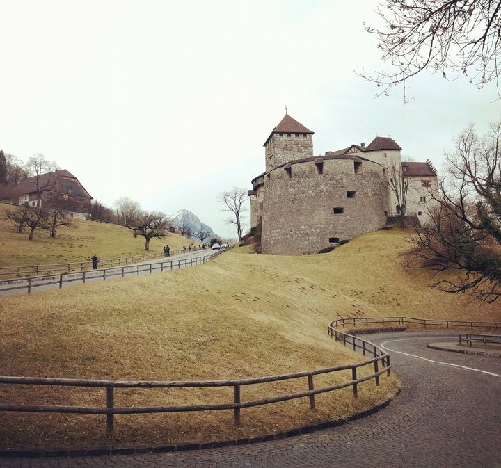

<!-- Main -->

<!-- One -->
<section id="one">
	

		<header class="major">
			<h2>Liechtenstein</h2>
		</header>
		
.

	

</section>

<!-- Two -->
<section id="two" class="spotlights">
	<section>
		
		

			

				<header class="major">
					<h3>Vaduz</h3>
				</header>
				
.

				<ul class="actions">
					<li><a href="liechtenstein.html" class="button">Learn more</a></li>
				</ul>
			

		

	</section>
</section>

