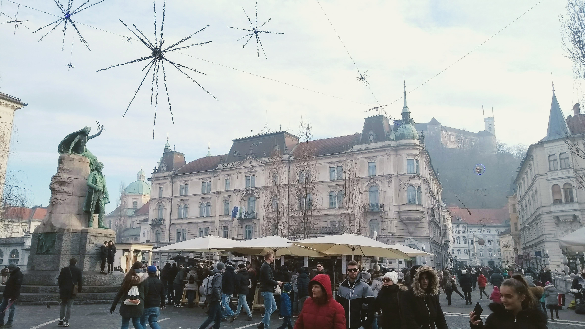
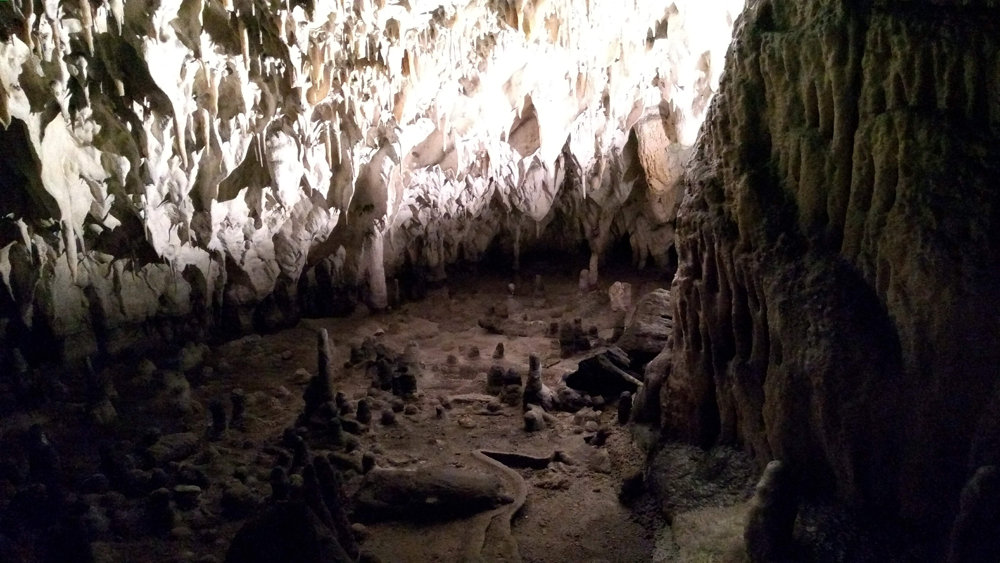

<!-- Main -->

<!-- One -->
<section id="one">
	

		<header class="major">
			<h2>Slovenia</h2>
		</header>
		
.

	

</section>

<!-- Two -->
<section id="two" class="spotlights">
	<section>
		
		

			

				<header class="major">
					<h3>Lake Bled</h3>
				</header>
				
.

				<ul class="actions">
					<li><a href="slovenia.html" class="button">Learn more</a></li>
				</ul>
			

		

	</section>
	<section>
		
		

			

				<header class="major">
					<h3>Ljubljana</h3>
				</header>
				
.

				<ul class="actions">
					<li><a href="slovenia.html" class="button">Learn more</a></li>
				</ul>
			

		

	</section>
	<section>
		
		

			

				<header class="major">
					<h3>Postojna Caves</h3>
				</header>
				
.

				<ul class="actions">
					<li><a href="slovenia.html" class="button">Learn more</a></li>
				</ul>
			

		

	</section>
</section>

<!-- Three -->
<section id="three">
	

		<header class="major">
			<h2>Slovenia</h2>
		</header>
		
.

		<ul class="actions">
			<li><a href="slovenia.html" class="button next">Get Started</a></li>
		</ul>
	

</section>

